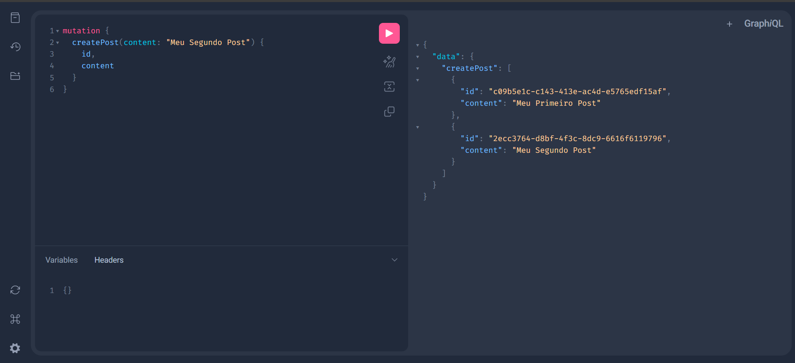
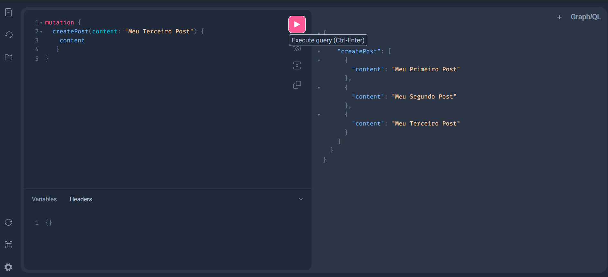
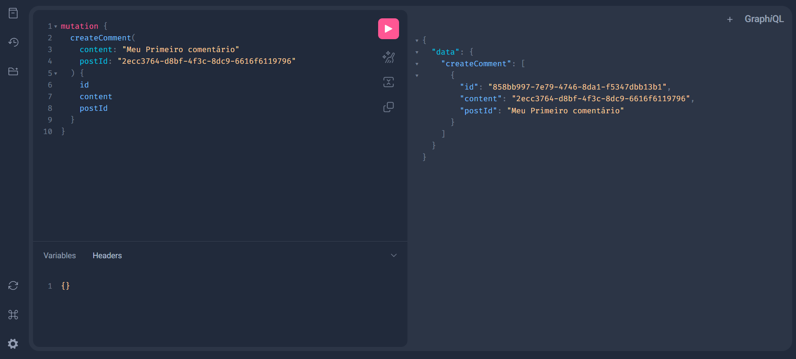
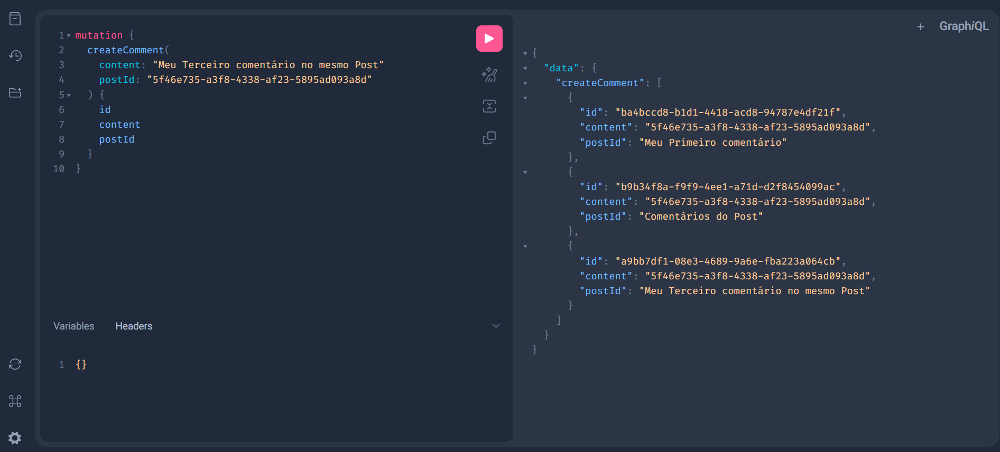

# Spring GraphQL Lab

Este projeto é um laboratório para explorar e demonstrar os fundamentos do uso com Java, Spring e GraphQL.

## Tecnologias Utilizadas

As tecnologias e suas versões utilizadas neste projeto estão especificadas no arquivo `pom.xml`. Abaixo estão listadas as principais tecnologias e as versões mínimas recomendadas para desenvolver este projeto:

- **Java**: 11+
- **Spring Boot**: 2.5.0+
- **GraphQL Java**: 16.0+
- **Spring for GraphQL**: 1.0.0+

## Estrutura do Projeto

O projeto está organizado da seguinte forma:

- **src/main/java**: Contém o código-fonte da aplicação.
- **src/main/resources/graphql**: Contém os arquivos de configuração e recursos do esquema de dados GraphQL. Lembrando que deve seguir regras de nomemclatura.
- **pom.xml**: Arquivo de configuração do Maven, onde estão listadas as dependências do projeto.

## Como Executar

Para executar o projeto, siga os passos abaixo:

1. Clone o repositório para sua máquina local.
2. Navegue até o diretório do projeto.
3. Execute o comando `mvn spring-boot:run` para iniciar a aplicação.
4. No http://localhost:8080/graphiql?path=/graphql interface GraphQL para testar a API. Segue algumas telas:

# Outros meios de testar API GraphQL

Existem várias ferramentas que podem ser utilizadas para testar e interagir com APIs GraphQL. Aqui estão algumas das opções mais populares:

## 1. **GraphiQL**

- **Descrição:** Uma das ferramentas mais populares para explorar e testar APIs GraphQL. Permite que você escreva consultas e visualize os resultados diretamente no navegador, com recursos como autocompletar e documentação interativa.
- **Características principais:**
  - Auto-complete de consultas
  - Navegação fácil pela documentação da API
  - Interface simples e fácil de usar
- **Uso comum:** Integrado em servidores GraphQL para uma experiência de desenvolvimento simples e rápida.
- **Fonte:** [GraphiQL no GitHub](https://github.com/graphql/graphiql)

## 2. **Apollo Studio**

- **Descrição:** Criado pela equipe da Apollo, o Apollo Studio oferece um ambiente interativo para desenvolver e testar APIs GraphQL. Ele também inclui análise de desempenho e monitoramento.
- **Características principais:**
  - Histórico de consultas
  - Ferramentas de performance e monitoramento
  - Suporte completo para execução de consultas em tempo real
- **Uso comum:** Amplamente utilizado por equipes que estão implementando o Apollo Server.
- **Fonte:** [Apollo Studio](https://www.apollographql.com/studio)

## 3. **Insomnia**

- **Descrição:** Insomnia é um cliente de API que suporta GraphQL, além de REST. É muito utilizado por desenvolvedores que preferem uma ferramenta mais completa para testar tanto GraphQL quanto APIs REST.
- **Características principais:**
  - Suporte para GraphQL e REST
  - Histórico de requisições
  - Variáveis de ambiente e automação de testes
- **Uso comum:** Ideal para desenvolvedores que trabalham com múltiplos tipos de API, permitindo testar APIs REST e GraphQL em um único local.
- **Fonte:** [Insomnia](https://insomnia.rest/)

## 4. **Postman**

- **Descrição:** Conhecido por ser uma ferramenta robusta de teste de APIs REST, o Postman agora também suporta GraphQL. Ele permite que você envie consultas, veja respostas e organize as suas APIs.
- **Características principais:**
  - Interface intuitiva para criar e testar queries GraphQL
  - Suporte a variáveis e ambientes
  - Testes automatizados e geração de relatórios
- **Uso comum:** Ideal para equipes que já usam o Postman e desejam integrar o teste de GraphQL.
- **Fonte:** [Postman GraphQL](https://www.postman.com/)

## 5. **GraphQL Playground**

- **Descrição:** Uma alternativa ao GraphiQL, o GraphQL Playground oferece uma interface rica e é fácil de configurar. Suporta múltiplos ambientes e outras funcionalidades como histórico de consultas e execução em tempo real.
- **Características principais:**
  - Execução de consultas em tempo real
  - Documentação interativa
  - Suporte a múltiplos ambientes
- **Uso comum:** Usado em ambientes de desenvolvimento locais para testar e interagir com APIs GraphQL.
- **Fonte:** [GraphQL Playground GitHub](https://github.com/graphql/graphql-playground)

## 6. **Altair GraphQL Client**

- **Descrição:** O Altair é uma ferramenta de cliente GraphQL que oferece uma experiência simples e amigável, sendo uma boa escolha para quem precisa de uma ferramenta leve e eficiente para executar consultas.
- **Características principais:**
  - Suporte completo para GraphQL
  - Interface minimalista
  - Recursos como cabeçalhos personalizados e variáveis de consulta
- **Uso comum:** Ideal para quem busca uma ferramenta leve e de fácil integração.
- **Fonte:** [Altair GraphQL Client](https://altair.sirmuel.design/)
